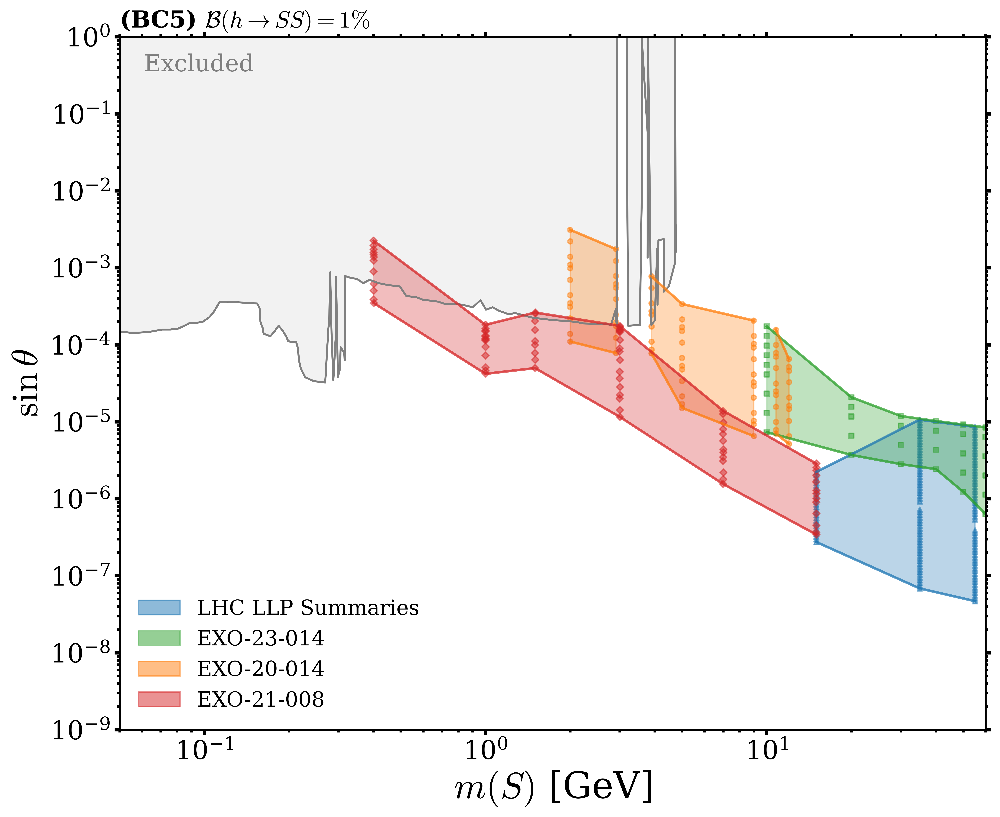
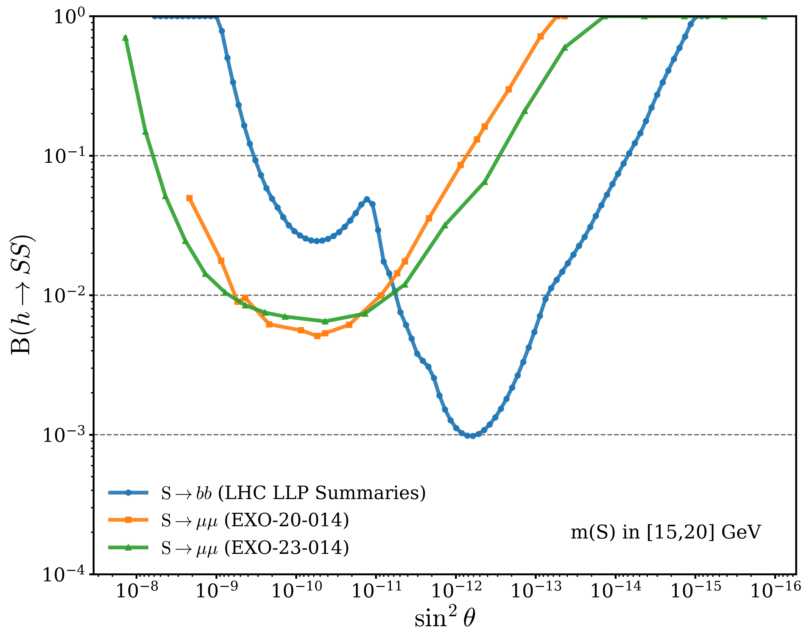
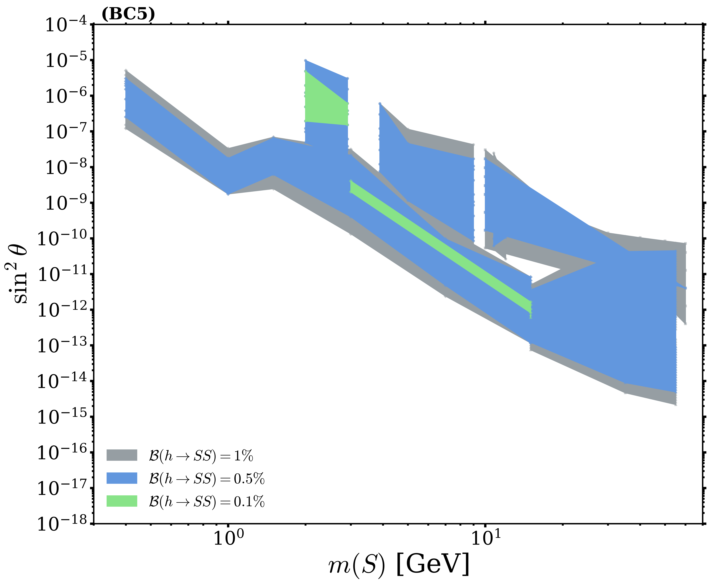
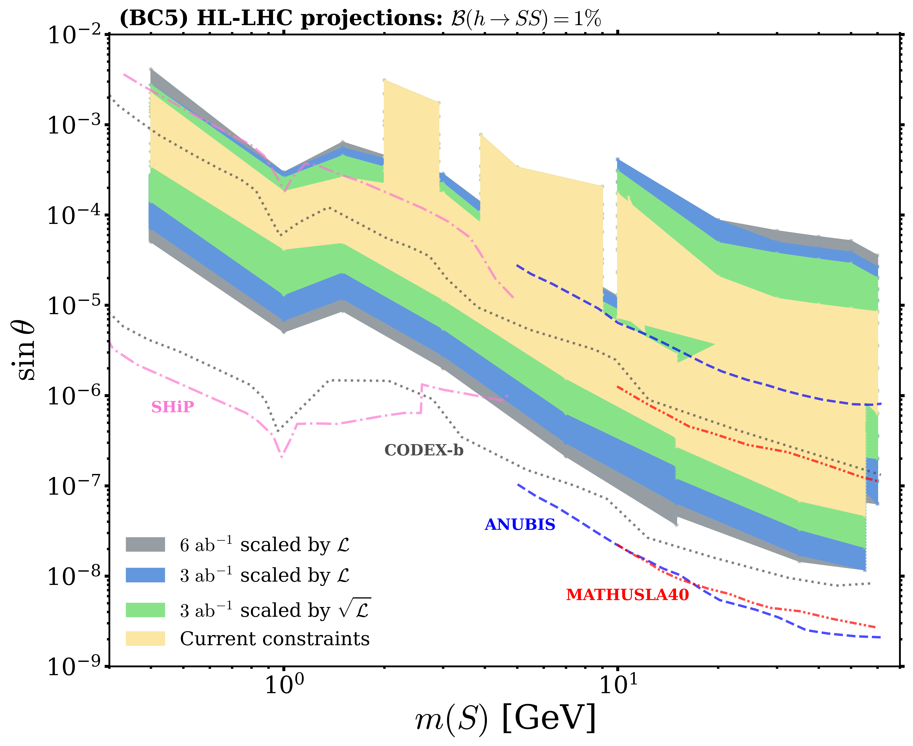
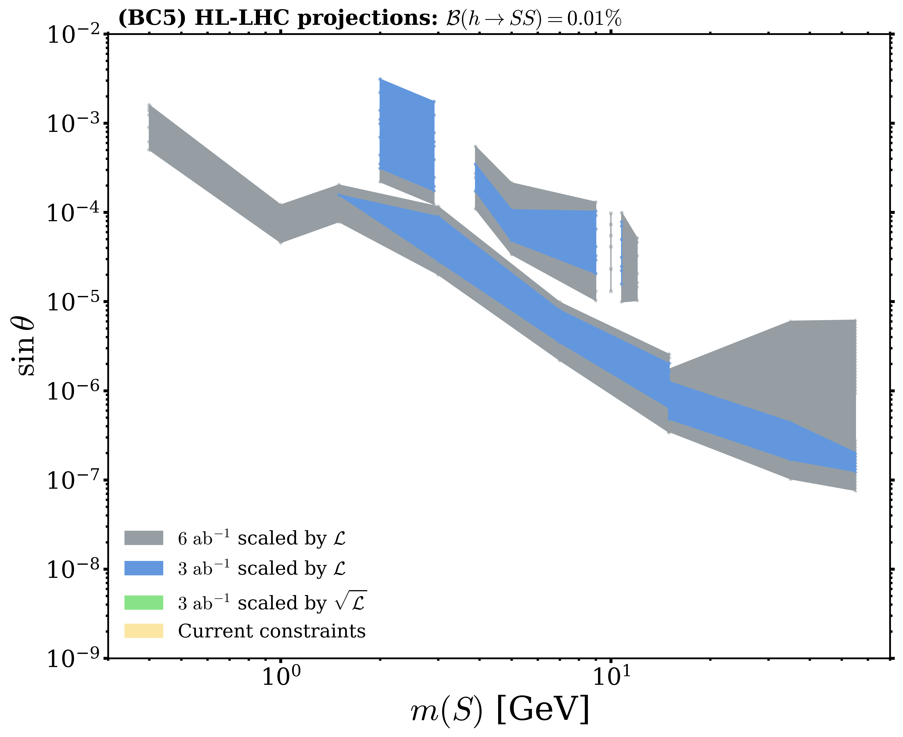

# Introduction

__Latest update:__ August 26th 2025

This repository contains the plots and results from a reinterpretation of LHC searches for long-lived particles (LLPs) in the SM + scalar singlet model, focusing on the Physics Beyond Colliders (PBC) benchmark scenario 5 (BC5), `arxiv.org/abs/XXXX.YYY` (to appear).

The full methodology and detailed discussion of the results are presented in the paper.

<p align="center">
    
</p>

Citation info: 
```
TBD
```

__Contact:__ Alberto Escalante del Valle

## Repository of results 

Results for: $\mathcal{B}(h \to SS)$ vs $\sin\theta$
-  m(s) = 0.4 GeV: [.png](plots_sintheta/BC5_comparison_sintheta_0p4GeV_all.png), [.pdf](plots_sintheta/BC5_comparison_sintheta_0p4GeV_all.pdf)
-  m(S) in [1.5,2] GeV: [.png](plots_sintheta/BC5_comparison_sintheta_1p5_2GeV_all.png), [.pdf](plots_sintheta/BC5_comparison_sintheta_1p5_2GeV_all.pdf)
-  m(S) in [5,7] GeV: [.png](plots_sintheta/BC5_comparison_sintheta_5_7GeV_all.png), [.pdf](plots_sintheta/BC5_comparison_sintheta_5_7GeV_all.pdf)
-  m(S) in [15,20] GeV: [.png](plots_sintheta/BC5_comparison_sintheta_15_20GeV_all.png), [.pdf](plots_sintheta/BC5_comparison_sintheta_15_20GeV_all.pdf)
-  m(S) in [30,40] GeV: [.png](plots_sintheta/BC5_comparison_sintheta_30_40GeV_all.png), [.pdf](plots_sintheta/BC5_comparison_sintheta_30_40GeV_all.pdf)
-  m(S) in [55,60] GeV: [.png](plots_sintheta/BC5_comparison_sintheta_55_60GeV_all.png), [.pdf](plots_sintheta/BC5_comparison_sintheta_55_60GeV_all.pdf)

Results in 2D plane: {$m(S), \sin\theta$}
- LHC constraints at $\mathcal{B}(h \to SS) = 1\%$: [.png](plots_sintheta/combined_exclusion_sintheta_BR_0.01_log.png), [.pdf](plots_sintheta/combined_exclusion_sintheta_BR_0.01_log.png)
- LHC constraints vs $\mathcal{B}(h \to SS)$: [.png](plots_sintheta/combined_exclusion_multi_threshold_sintheta_log.png), [.pdf](plots_sintheta/combined_exclusion_multi_threshold_sintheta_log.png)
- HL-LHC projections:
  - at $\mathcal{B}(h \to SS) = 1\%$: [.png](plots_sintheta/combined_exclusion_multi_threshold_sintheta_hl_lhc_0.01_log.png), [.pdf](plots_sintheta/combined_exclusion_multi_threshold_sintheta_hl_lhc_0.01_log.pdf)
  - at $\mathcal{B}(h \to SS) = 0.01\%$: [.png](plots_sintheta/combined_exclusion_multi_threshold_sintheta_hl_lhc_0.0001_log.png), [.pdf](plots_sintheta/combined_exclusion_multi_threshold_sintheta_hl_lhc_0.0001_log.pdf)

----

Results for: $\mathcal{B}(h \to SS)$ vs $\sin^{2}\theta$
-  m(s) = 0.4 GeV: [.png](plots_sin2theta/BC5_comparison_sin2theta_0p4GeV_all.png), [.pdf](plots_sin2theta/BC5_comparison_sin2theta_0p4GeV_all.pdf)
-  m(S) in [1.5,2] GeV: [.png](plots_sin2theta/BC5_comparison_sin2theta_1p5_2GeV_all.png), [.pdf](plots_sin2theta/BC5_comparison_sin2theta_1p5_2GeV_all.pdf)
-  m(S) in [5,7] GeV: [.png](plots_sin2theta/BC5_comparison_sin2theta_5_7GeV_all.png), [.pdf](plots_sin2theta/BC5_comparison_sin2theta_5_7GeV_all.pdf)
-  m(S) in [15,20] GeV: [.png](plots_sin2theta/BC5_comparison_sin2theta_15_20GeV_all.png), [.pdf](plots_sin2theta/BC5_comparison_sin2theta_15_20GeV_all.pdf)
-  m(S) in [30,40] GeV: [.png](plots_sin2theta/BC5_comparison_sin2theta_30_40GeV_all.png), [.pdf](plots_sin2theta/BC5_comparison_sin2theta_30_40GeV_all.pdf)
-  m(S) in [55,60] GeV: [.png](plots_sin2theta/BC5_comparison_sin2theta_55_60GeV_all.png), [.pdf](plots_sin2theta/BC5_comparison_sin2theta_55_60GeV_all.pdf)

Results in 2D plane: {$m(S), \sin^{2}\theta$}
- LHC constraints at $\mathcal{B}(h \to SS) = 1\%$: [.png](plots_sin2theta/combined_exclusion_sin2theta_BR_0.01_log.png), [.pdf](plots_sin2theta/combined_exclusion_sin2theta_BR_0.01_log.png)
- LHC constraints vs $\mathcal{B}(h \to SS)$: [.png](plots_sin2theta/combined_exclusion_multi_threshold_sin2theta_log.png), [.pdf](plots_sin2theta/combined_exclusion_multi_threshold_sin2theta_log.png)
- HL-LHC projections:
  - at $\mathcal{B}(h \to SS) = 1\%$: [.png](plots_sin2theta/combined_exclusion_multi_threshold_sin2theta_hl_lhc_0.01_log.png), [.pdf](plots_sin2theta/combined_exclusion_multi_threshold_sin2theta_hl_lhc_0.01_log.pdf)
  - at $\mathcal{B}(h \to SS) = 0.01\%$: [.png](plots_sin2theta/combined_exclusion_multi_threshold_sin2theta_hl_lhc_0.0001_log.png), [.pdf](plots_sin2theta/combined_exclusion_multi_threshold_sin2theta_hl_lhc_0.0001_log.pdf)

where $m(S)$ is the mass of the scalar particle and $\theta$ is its mixing angle with the SM Higgs boson. References to the original experimental searches are provided in that paper.

Further results are available upon request.

## Main results in the paper:

<p align="center">
    
</p>
<p align="center">
    
</p>
<p align="center">
    
</p>
<p align="center">
    
</p>